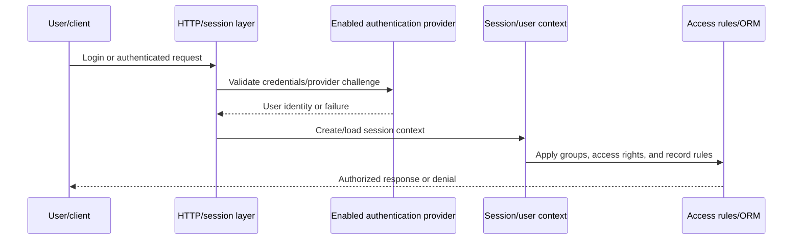

# Authentication Flow

```mermaid
sequenceDiagram
  participant U as User/client
  participant H as HTTP/session layer
  participant A as Enabled authentication provider
  participant S as Session/user context
  participant Z as Access rules/ORM
  U->>H: Login or authenticated request
  H->>A: Validate credentials/provider challenge
  A-->>H: User identity or failure
  H->>S: Create/load session context
  S->>Z: Apply groups, access rights, and record rules
  Z-->>U: Authorized response or denial
```

The enabled provider may be local authentication or an optional LDAP/OAuth/passkey/TOTP addon. Exact challenges and session settings require deployment verification.

