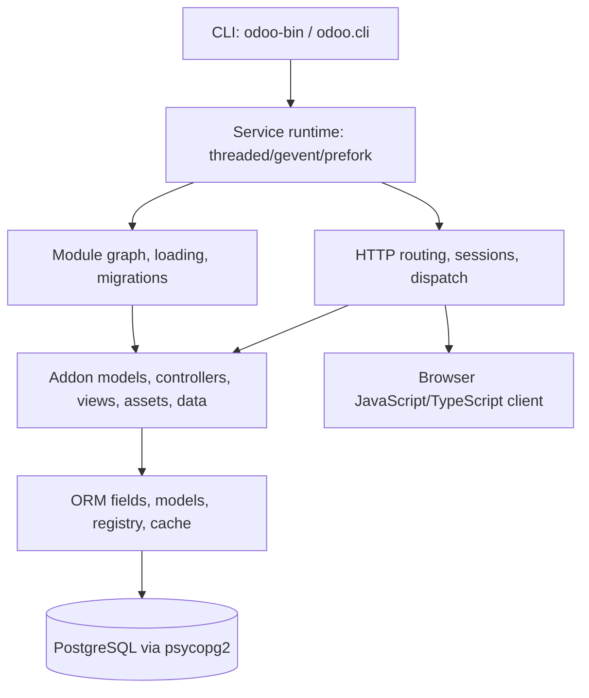

# Component Architecture

```mermaid
flowchart TB
  CLI[CLI: odoo-bin / odoo.cli]
  SRV[Service runtime: threaded/gevent/prefork]
  HTTP[HTTP routing, sessions, dispatch]
  ORM[ORM fields, models, registry, cache]
  MOD[Module graph, loading, migrations]
  ADD[Addon models, controllers, views, assets, data]
  DB[(PostgreSQL via psycopg2)]
  WEB[Browser JavaScript/TypeScript client]
  CLI --> SRV
  SRV --> HTTP
  SRV --> MOD
  MOD --> ADD
  ADD --> ORM
  HTTP --> WEB
  HTTP --> ADD
  ORM --> DB
```

This diagram describes source boundaries, not independent deployables.
