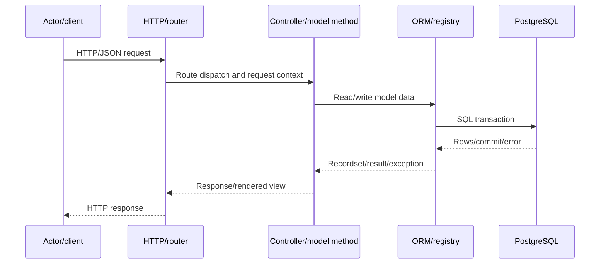

# Data Flow

```mermaid
sequenceDiagram
  participant A as Actor/client
  participant H as HTTP/router
  participant C as Controller/model method
  participant O as ORM/registry
  participant P as PostgreSQL
  A->>H: HTTP/JSON request
  H->>C: Route dispatch and request context
  C->>O: Read/write model data
  O->>P: SQL transaction
  P-->>O: Rows/commit/error
  O-->>C: Recordset/result/exception
  C-->>H: Response/rendered view
  H-->>A: HTTP response
```

External services, mail, bus notifications, scheduled actions, and attachment storage are conditional branches implemented by relevant addons.
