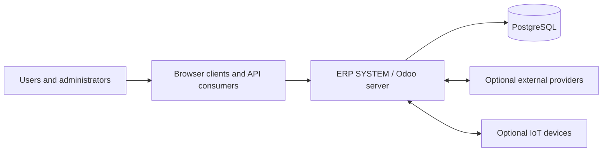

# System Context Diagram

```mermaid
flowchart LR
  Users[Users and administrators]
  Clients[Browser clients and API consumers]
  ERP[ERP SYSTEM / Odoo server]
  DB[(PostgreSQL)]
  Providers[Optional external providers]
  Devices[Optional IoT devices]
  Users --> Clients
  Clients --> ERP
  ERP --> DB
  ERP <--> Providers
  ERP <--> Devices
```

External systems are shown only where integration addons and runtime extension points exist. A specific deployment may enable none, some, or all of them.

