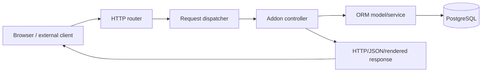

# API Architecture

```mermaid
flowchart LR
  CLIENT[Browser / external client] --> ROUTER[HTTP router]
  ROUTER --> DISPATCH[Request dispatcher]
  DISPATCH --> CTRL[Addon controller]
  CTRL --> MODEL[ORM model/service]
  MODEL --> DB[(PostgreSQL)]
  CTRL --> RESP[HTTP/JSON/rendered response]
  RESP --> CLIENT
```

Route evidence is enumerated in `Route_Inventory.csv`. Request and response schemas are route-specific and must be extracted from the corresponding controller implementation.

