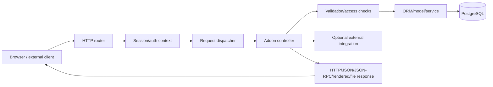

# API Architecture — Phase 7

```mermaid
flowchart LR
  CLIENT[Browser / external client] --> ROUTER[HTTP router]
  ROUTER --> SESSION[Session/auth context]
  SESSION --> DISPATCH[Request dispatcher]
  DISPATCH --> CTRL[Addon controller]
  CTRL --> VALIDATE[Validation/access checks]
  VALIDATE --> SERVICE[ORM/model/service]
  SERVICE --> DB[(PostgreSQL)]
  CTRL --> EXT[Optional external integration]
  CTRL --> RESP[HTTP/JSON/JSON-RPC/rendered/file response]
  RESP --> CLIENT
```

Route evidence is enumerated in `API_Endpoint_Inventory.csv`; candidate callbacks are enumerated in `Webhook_Inventory.csv`.
