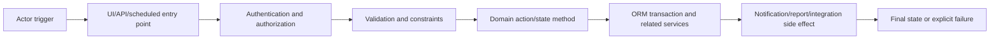

# Module Business Workflow Template

```mermaid
flowchart LR
 A[Actor trigger] --> B[UI/API/scheduled entry point]
 B --> C[Authentication and authorization]
 C --> D[Validation and constraints]
 D --> E[Domain action/state method]
 E --> F[ORM transaction and related services]
 F --> G[Notification/report/integration side effect]
 G --> H[Final state or explicit failure]
```

For a specific module, replace each node only with evidence from its source page and mark unknown transitions as Requires Verification.
