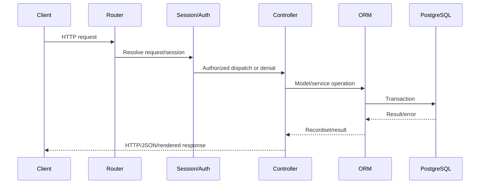
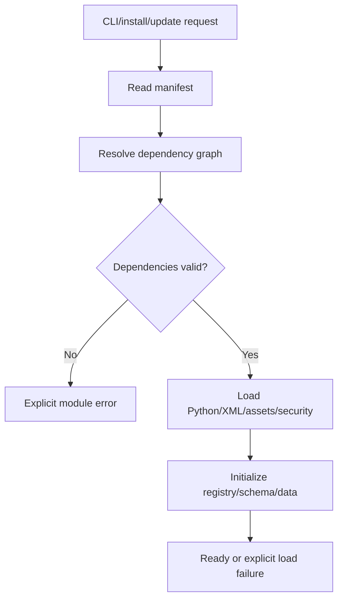
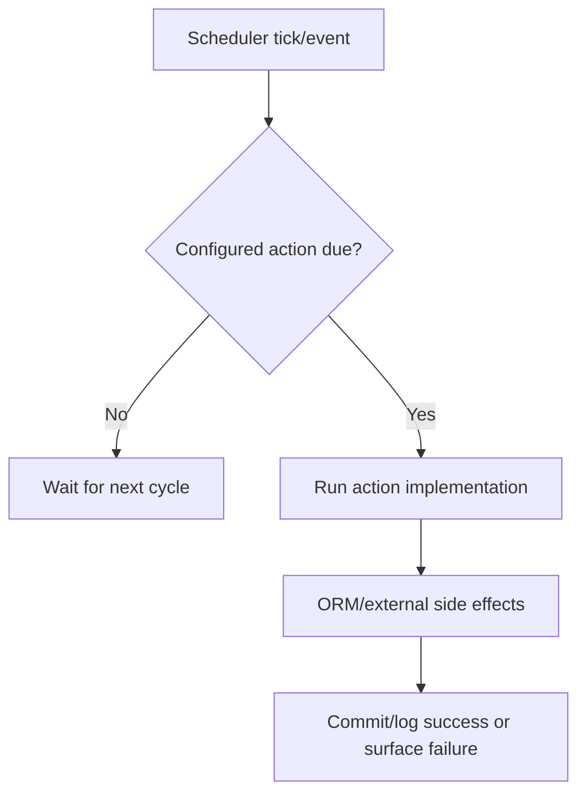

# Platform Workflow Diagrams

## Request lifecycle

```mermaid
sequenceDiagram
 participant C as Client
 participant R as Router
 participant S as Session/Auth
 participant H as Controller
 participant O as ORM
 participant D as PostgreSQL
 C->>R: HTTP request
 R->>S: Resolve request/session
 S->>H: Authorized dispatch or denial
 H->>O: Model/service operation
 O->>D: Transaction
 D-->>O: Result/error
 O-->>H: Recordset/result
 H-->>C: HTTP/JSON/rendered response
```

## Module lifecycle

```mermaid
flowchart TD
 A[CLI/install/update request] --> B[Read manifest]
 B --> C[Resolve dependency graph]
 C --> D{Dependencies valid?}
 D -- No --> E[Explicit module error]
 D -- Yes --> F[Load Python/XML/assets/security]
 F --> G[Initialize registry/schema/data]
 G --> H[Ready or explicit load failure]
```

## Scheduled action

```mermaid
flowchart TD
 A[Scheduler tick/event] --> B{Configured action due?}
 B -- No --> C[Wait for next cycle]
 B -- Yes --> D[Run action implementation]
 D --> E[ORM/external side effects]
 E --> F[Commit/log success or surface failure]
```
